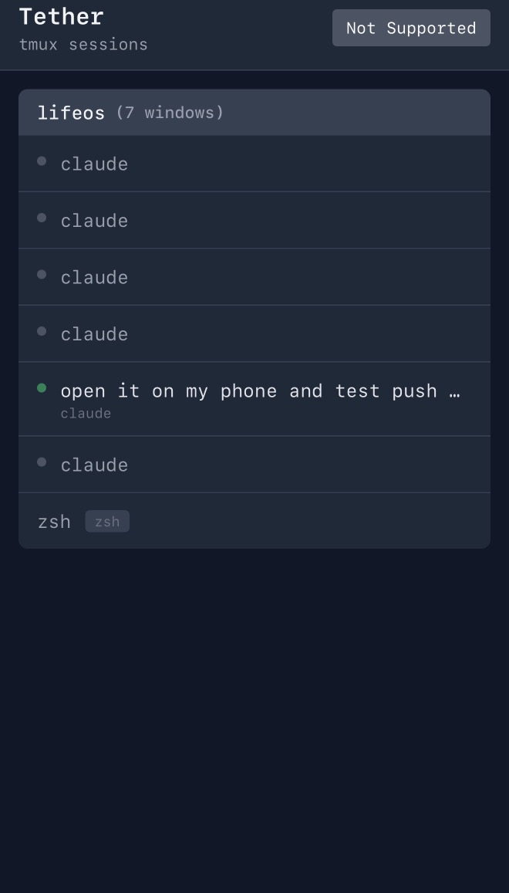
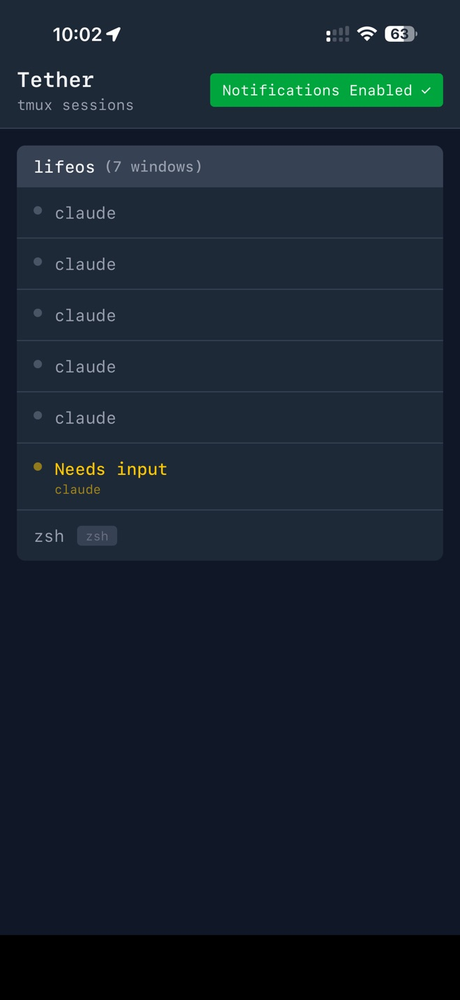
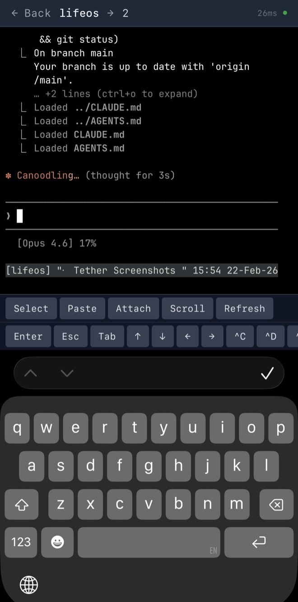
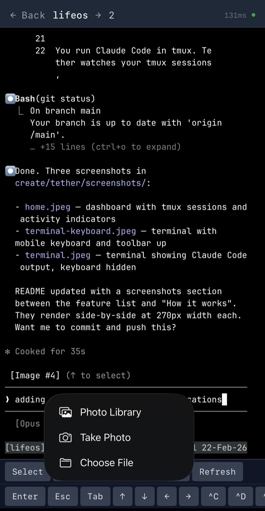
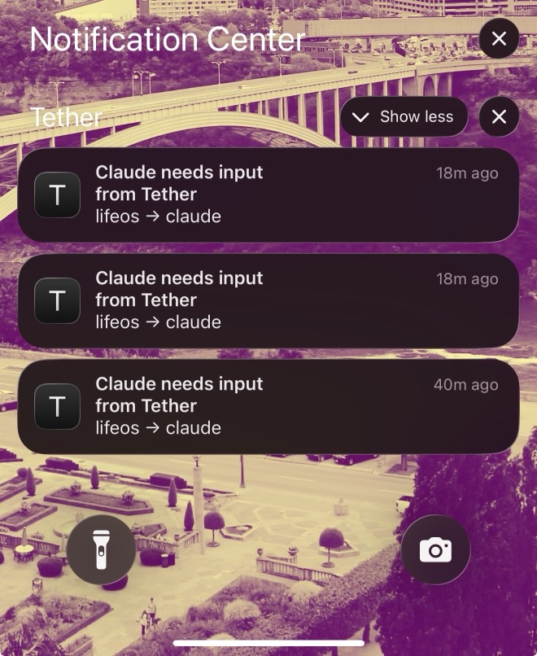

# Tether

Control your AI coding agents from your phone.

## How AI coding agents work

You give an AI coding agent a task — "add user authentication" or "fix the checkout bug." The agent works on its own: reading your code, writing changes, running tests, iterating when something fails. This can go on for minutes or hours.

But agents aren't fully autonomous. They regularly need your judgment: "Should I refactor this or patch it?" "Two approaches could work — which do you prefer?" "Tests pass but I'm not sure about this edge case." They stop and wait for you.

If you're at your desk, you answer and they continue. If you're not, the agent sits idle until you come back. That idle time adds up — especially when you're running multiple agents on different tasks.

## What Tether does

Tether connects your phone to the agents running on your desktop or home server. Your phone buzzes the moment any agent needs you. Tap the notification, respond, put the phone down. The agent continues. The whole interaction takes ten seconds.

You don't have to sit at your desk and watch. Start a few agents, step away, live your life. Check in from the couch, from a coffee shop, while cooking dinner. Your agents keep working and reach out when they need you.

- Your phone buzzes when an agent needs input — you don't have to remember to check
- Full terminal on your phone — not a simplified view, the real thing
- See all your agents at a glance — which are working, which need you
- Send files from your phone — screenshots, photos, documents straight into the terminal
- Self-hosted on your own machine — nothing leaves your network

## Screenshots

<p align="center">
  
  
  
  
  
</p>

## What you need

Tether builds on two tools:

**tmux** keeps your agents running when you're not looking. Think of it as browser tabs for your terminal — close the window, switch devices, the agents keep going. If you've never used tmux, there's a [5-minute intro](https://kmganesh.com/projects/tether/#tmux-in-5-minutes) that explains it in terms you already know.

**Tailscale** connects your devices on a private network. It's how your phone reaches your home machine securely — no port forwarding, no public servers. Takes about two minutes to set up.

Both are `brew install` away. Tether runs on macOS (Apple Silicon).

## Get started

### 1. Install

```bash
brew install --cask tailscale  # if you don't have it yet
brew tap kmg/tether
brew install tether
```

### 2. Start an agent in tmux

```bash
tmux new-session -s work
claude
```

Already use tmux? Skip this — Tether detects Claude in any window of any session.

### 3. Connect your phone

Generate certificates so your phone can reach Tether securely:

```bash
TS_HOST=$(tailscale status --json | jq -r '.Self.DNSName' | sed 's/\.$//')
mkdir -p ~/.local/share/tether/cert
cd ~/.local/share/tether/cert
tailscale cert "$TS_HOST"
```

Tell Tether where to find them:

```bash
CERT_DIR="$HOME/.local/share/tether/cert"
cat > ~/.local/share/tether/env <<EOF
TLS_CERTFILE=$CERT_DIR/$TS_HOST.crt
TLS_KEYFILE=$CERT_DIR/$TS_HOST.key
PHX_HOST=$TS_HOST
EOF
```

Start Tether and get the URL for your phone:

```bash
brew services start tether
echo "https://$TS_HOST:7374?token=$(cat ~/.local/share/tether/.token)"
```

Open that URL on your phone. Paste the token. You stay logged in for 30 days.

### 4. Turn on push notifications

```bash
grep -q "VAPID_PUBLIC_KEY" ~/.local/share/tether/env 2>/dev/null || tether setup-push >> ~/.local/share/tether/env
brew services restart tether
```

On your phone, tap the **bell icon** in the header (shows **Off**). Accept the prompt — it switches to **On**.

For background notifications, save to your home screen (iOS: Share → Add to Home Screen).

Now walk away. Your phone will buzz when an agent needs you.

## Updating

```bash
brew update
brew upgrade tether
brew services restart tether
```

## Configuration

Tether reads `~/.local/share/tether/env` on every start.

| Variable | Default | Description |
|----------|---------|-------------|
| `PORT` | `7374` | HTTP/HTTPS port |
| `PHX_HOST` | `localhost` | Hostname for URLs |
| `TETHER_TOKEN` | auto-generated | Auth token (printed on startup) |
| `TLS_CERTFILE` | — | TLS certificate (enables HTTPS) |
| `TLS_KEYFILE` | — | TLS private key (enables HTTPS) |
| `VAPID_PUBLIC_KEY` | — | Enables push notifications |
| `VAPID_PRIVATE_KEY` | — | Enables push notifications |

Any TLS certs work — Tailscale is recommended but not required.

### Compared to Remote Control

Claude Code's [Remote Control](https://code.claude.com/docs/en/remote-control) gives you mobile access to individual sessions. Tether is for when you're running agents on a home server and want push notifications across all your sessions plus a mobile-optimized terminal.

## This tool should become unnecessary

Tether solves a specific bottleneck: agents need your judgment and you're not at your desk. If Claude Code adds native push notifications, or agents become autonomous enough to skip the human loop, Tether becomes unnecessary. That's fine. Build for the bottleneck you have.

## Architecture

See [ARCHITECTURE.md](ARCHITECTURE.md) for how detection works, the notification pipeline, and the technology stack.

## License

MIT
